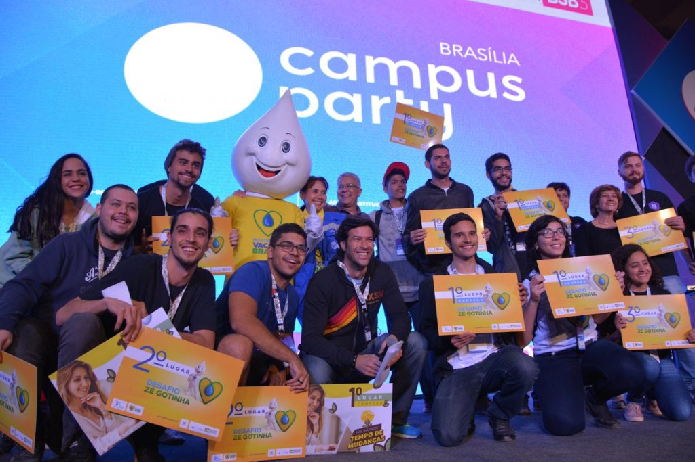

# Brazilian Vaccine Coverage Website with Geospatial Visualization
Website developed at Brazilian Ministry of Health's hackathon (Campus Party Brasilia 2019).

# Overview

The platform main purpose is to identify critical vaccine coverage regions in Brazil.

MetaData Team won the **1st place** with this module, a [data preparation stage](https://github.com/brunomoraisnc/hackathon-ze-gotinha-geospatial-data-preparation), and [a mobile app](https://github.com/brunomoraisnc/HackathonZeGotinha).

## Main panel

## Map

# Records

## Post presentation

## Award winners
